# Laporan Proyek Machine Learning - Zaky Al Fatih Nata Imam

---

## Domain Project

Proyek ini bertujuan membangun sistem rekomendasi film menggunakan dataset (https://www.kaggle.com/datasets/rounakbanik/the-movies-dataset) dari Kaggle. Latar belakangnya adalah bertambahnya jumlah film yang tersedia, sehingga pengguna kesulitan menemukan film sesuai preferensi mereka. Sistem rekomendasi membantu pengguna menemukan film baru yang relevan berdasarkan riwayat tontonan atau kesamaan karakteristik film.

Tanpa sistem rekomendasi, pengguna akan kesulitan mencari film secara manual atau melewatkan film berkualitas. Sistem ini meningkatkan pengalaman menonton, kepuasan pengguna, dan engagement platform penyedia film.

Dua pendekatan utama dalam sistem rekomendasi yang digunakan adalah:

- **Collaborative Filtering**: merekomendasikan film berdasarkan preferensi pengguna lain yang memiliki selera serupa (Sarwar et al., 2001).
- **Content-Based Filtering**: merekomendasikan film berdasarkan kemiripan karakteristik film yang pernah disukai pengguna (Pazzani & Billsus, 2007).

---

## Business Understanding

### Problem Statements

- Bagaimana membantu pengguna menemukan film sesuai preferensi genre dari ribuan film?
- Bagaimana memberikan rekomendasi berdasarkan histori tontonan dan rating pengguna, serta preferensi pengguna lain yang mirip?

### Goals

- Membangun sistem rekomendasi film berbasis **Content-Based Filtering (CBF)** yang merekomendasikan berdasarkan kesamaan genre.
- Membangun sistem rekomendasi film berbasis **Collaborative Filtering (CF)** menggunakan Deep Learning berdasarkan histori rating dan pola pengguna.

### Solution Statements

#### Content-Based Filtering (CBF)

- Gunakan TF-IDF untuk bobot fitur genre.
- Hitung kemiripan antar film menggunakan Cosine Similarity.
- Hasilkan rekomendasi Top-N film paling mirip genre dengan film yang dipilih.

#### Collaborative Filtering (CF) dengan Deep Learning

- Encode `userId` dan `movieId` menjadi representasi numerik.
- Bangun model Deep Learning dengan embedding layers untuk mempelajari representasi laten pengguna dan film.
- Hitung skor kecocokan lewat dot product embedding + bias.
- Gunakan sigmoid untuk output skor dalam rentang [0,1].
- Latih model dengan data rating, evaluasi pakai MAE dan RMSE.
- Hasilkan rekomendasi Top-N film yang diprediksi disukai pengguna.

---

## Data Understanding

Dataset berasal dari Kaggle:
(https://www.kaggle.com/datasets/rounakbanik/the-movies-dataset)

### Informasi Dataset

Dataset yang digunakan adalah The Movies Dataset. Informasi mengenai dataset film ini dijelaskan sebagai berikut:

Sumber: Dataset tersedia di Kaggle

Pemilik Dataset: Rounak Banik

Lisensi: CC0 (Public Domain)

Kategori: Movies & TV Shows

Format dan Ukuran Berkas: ZIP Version 7 dengan ukuran sekitar 943.76 MB

Jumlah File dalam Dataset: Terdiri dari 7 file CSV

Dari informasi tersebut, diketahui bahwa file-file dalam dataset ini berisi metadata untuk sekitar 45.000 film yang tercakup dalam Full MovieLens Dataset. Data film tersebut merupakan film-film yang dirilis pada atau sebelum Juli 2017. Informasi yang tersedia meliputi pemeran, kru, kata kunci plot, anggaran, pendapatan, poster, tanggal rilis, bahasa, perusahaan produksi, negara asal, jumlah suara di TMDB, serta rata-rata rating.

Selain itu, dataset ini juga mencakup file yang berisi sekitar 26 juta rating yang diberikan oleh 270.000 pengguna untuk seluruh 45.000 film tersebut. Rating yang digunakan memiliki skala 1 hingga 5 dan berasal dari situs resmi GroupLens.

Berikut penjelasan singkat mengenai file-file dalam kumpulan data ini:

movie_metadata.csv: File utama berisi metadata film untuk 45.000 film dalam dataset Full MovieLens. Fitur yang tersedia antara lain poster, latar belakang, anggaran, pendapatan, tanggal rilis, bahasa, negara produksi, dan perusahaan produksi.

keywords.csv: Berisi kata kunci plot film dalam bentuk objek JSON yang dirangkai.

credits.csv: Informasi tentang pemeran dan kru untuk semua film, disajikan dalam format objek JSON yang dirangkai.

links.csv: File yang memuat ID TMDB dan IMDB dari seluruh film dalam Full MovieLens Dataset.

links_small.csv: Memuat ID TMDB dan IMDB untuk sebagian kecil sekitar 9.000 film dari dataset lengkap.

rating_small.csv: Bagian kecil dari dataset rating, terdiri dari 100.000 rating yang diberikan oleh 700 pengguna untuk 9.000 film.

Statistik Umum Data set
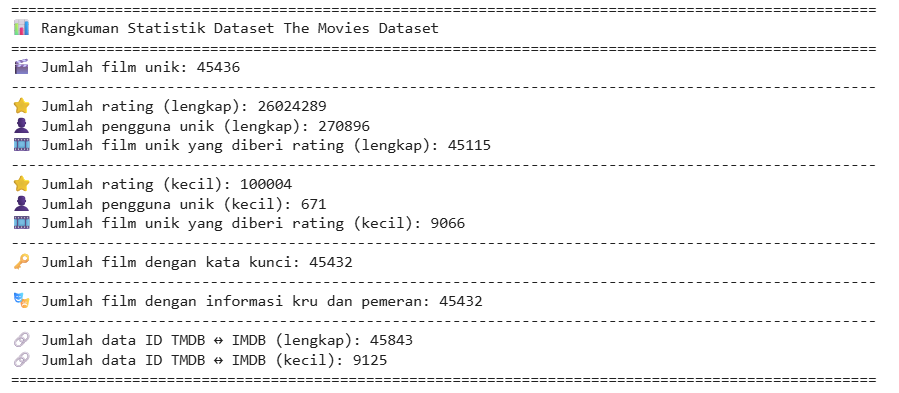
Gambar di atas menunjukkan total data yang terdapat dalam berbagai file dataset film.

Dalam proyek ini, hanya dua file CSV yang digunakan, yaitu ratings_small.csv (disimpan dalam variabel ratings) dan movies_metadata.csv (disimpan dalam variabel movies).

Variabel utama yang digunakan:

| Dataset             | Variabel                                    | Keterangan           |
| ------------------- | ------------------------------------------- | -------------------- |
| movies_metadata.csv | id, genres, title, vote_average, vote_count | Metadata film        |
| ratings_small.csv   | userId, movieId, rating, timestamp          | Data rating pengguna |

- **movies_metadata.csv**: Detail 45.436 film.
- **ratings_small.csv**: 100.004 rating dari 671 pengguna terhadap 9.066 film.

- Rating terbanyak: 4.0 (28.7%), 3.0 (20.1%), 5.0 (15.1%).
- Genre paling banyak: Drama, Comedy (>13.000 film).
- Film dengan skor tertinggi: _Dilwale Dulhania Le Jayenge_.
- Film dengan rating terbanyak: _Terminator 3: Rise of the Machines_ (324 rating, rata-rata 4.25).

### Eksplorasi Data (EDA)

1.  Analisis Univariate
    Pada tahap ini, dilakukan analisis statistik terhadap variabel movies dan ratings untuk memahami distribusi, pola, dan karakteristik data. Selain itu, grafik digunakan untuk memvisualisasikan distribusi genre dan rating film, serta menggambarkan hubungan antar fitur dalam dataset.

    - **Deskripsi Variabel**

    Pada tahap ini, akan disajikan penjelasan mengenai variabel-variabel yang digunakan, yaitu:
    a. Ratings (file ratings_small.csv)
    Penjelasan mengenai variabel tersebut.
    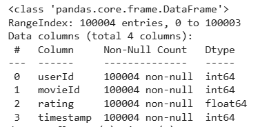

    Berdasarkan gambar di atas, variabel ratings terdiri dari 100.004 baris dan 4 kolom. Penjelasan masing-masing kolom adalah sebagai berikut:

        userId: Merupakan identitas unik untuk setiap pengguna yang memberikan rating. Digunakan untuk mengidentifikasi pengguna secara anonim.

        movieId: Merupakan identitas unik untuk setiap film yang dinilai oleh pengguna. ID ini digunakan untuk menghubungkan data dengan informasi film yang lebih lengkap.

        rating: Nilai penilaian yang diberikan oleh pengguna terhadap sebuah film, menggunakan skala 1 hingga 5. Semakin tinggi nilainya, semakin positif penilaian pengguna terhadap film tersebut.

        timestamp: Waktu ketika rating diberikan, direpresentasikan dalam format UNIX timestamp, yaitu jumlah detik sejak 1 Januari 1970.

    b. Movies (movies_metadata.csv)
    Penjelasan mengenai variabel-variabel dalam dataset movies dapat dilihat pada gambar berikut:
    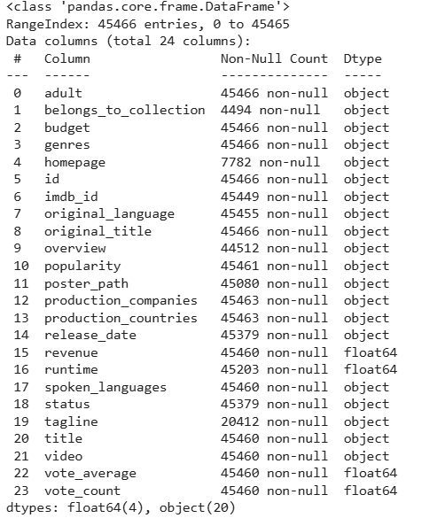
    Berdasarkan gambar di atas, dataset movies terdiri dari 100.004 baris dan 24 kolom. Penjelasan dari masing-masing variabel adalah sebagai berikut:

         adult: Menunjukkan apakah film tersebut mengandung konten dewasa. Nilai yang digunakan biasanya berupa True atau False.

         belongs_to_collection: Informasi mengenai apakah film termasuk dalam suatu koleksi atau seri tertentu (contohnya, seri Harry Potter). Biasanya ditampilkan dalam format JSON atau teks deskriptif.

         budget: Anggaran produksi film, umumnya dalam satuan dolar AS (USD), dengan nilai berupa angka.

         genres: Daftar genre yang terkait dengan film, seperti Action, Comedy, atau Drama. Formatnya biasanya berupa JSON atau daftar string.

         homepage: Alamat URL resmi dari situs web film tersebut.

         id: ID unik yang mengidentifikasi film, biasanya berasal dari database seperti TMDb.

         imdb_id: ID unik film di platform IMDb, dengan format seperti tt1234567.

         original_language: Kode bahasa asli film menggunakan standar ISO 639-1, contohnya en untuk Bahasa Inggris.

         original_title: Judul asli film dalam bahasa produksinya.

         overview: Ringkasan atau deskripsi singkat mengenai alur cerita film.

         popularity: Skor popularitas film, biasanya dihitung melalui algoritma dari platform tertentu.

         poster_path: Path menuju file poster film. Biasanya perlu digabungkan dengan URL dasar agar bisa diakses penuh.

         production_companies: Informasi tentang perusahaan yang memproduksi film. Umumnya dalam format JSON yang mencakup nama dan ID perusahaan.

         production_countries: Negara-negara tempat produksi film berlangsung. Biasanya dalam format JSON yang menyertakan nama dan kode negara.

         release_date: Tanggal resmi perilisan film dalam format YYYY-MM-DD.

         revenue: Pendapatan yang dihasilkan film secara keseluruhan, umumnya dalam satuan USD.

         runtime: Durasi film dalam satuan menit.

         spoken_languages: Bahasa yang digunakan dalam dialog film. Biasanya dalam bentuk JSON yang menyertakan kode dan nama bahasa.

         status: Status film tersebut, misalnya Released (Telah Dirilis) atau In Production (Sedang Diproduksi).

         tagline: Frasa atau slogan promosi yang melekat pada film.

         title: Judul utama film yang umum digunakan dalam publikasi.

         video: Menunjukkan apakah film memiliki video terkait. Nilainya biasanya True atau False.

         vote_average: Rata-rata nilai rating dari pengguna, biasanya menggunakan skala 1–10.

         vote_count: Jumlah total rating atau ulasan yang diberikan pada film tersebut.

    **Menghitung Total Dataset**

            Pada tahap ini, dilakukan perhitungan jumlah entri dan kolom dari masing-masing dataset. Dataset movies terdiri dari 45.466 baris dengan 5 kolom, sedangkan dataset ratings memiliki 100.004 baris dan 4 kolom.

    **Memeriksa Tipe Data**
    Infromasi dari tipe data variabel dapat dilihat pada gambar berikut:

            *Variable movies*

    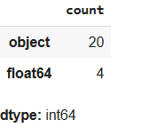
    _Variabel ratings_
    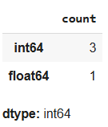
    Dapat dilihat pada informasi dataset **movies** 20 variable dengan tipe data object dan 4 variabel bertipe float64. Sedangkan pada informasi dataset **ratings** terdapat 1 variabel dengan tipe data float64 dan 3 variable dengan tipe data int64.

    **Menghitung Total Data Unik**
    Jumlah rincian data unik dapat dilihat pada gambar berikut:

    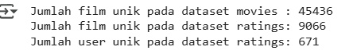
    Berdasarkan hasil di atas, terdapat 45.436 film pada dataset movies, 9.066 film yang muncul dalam dataset ratings, serta 671 pengguna yang memberikan rating dalam dataset ratings.

    - **Distribusi Ratings**
      Langkah ini bertujuan untuk:
    - Mengidentifikasi nilai rating yang paling umum diberikan oleh pengguna.
    - Menilai apakah data rating cenderung condong ke satu nilai (misalnya, lebih banyak rating tinggi atau rendah).
    - Membantu memahami pola preferensi pengguna.

    Tampilan distribusi rating dapat dilihat pada gambar berikut:
    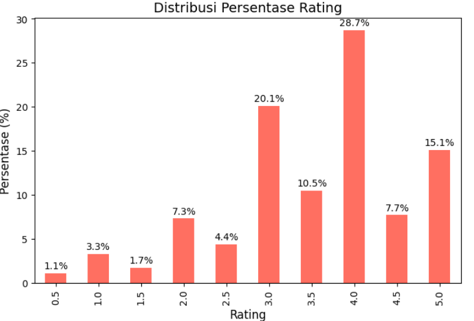
    Berdasarkan diagram plot rating di atas, terlihat bahwa nilai rating yang paling sering diberikan oleh pengguna adalah 4.0 dengan persentase 28,7%, diikuti oleh rating 3.0 sebesar 20,1%, dan rating 5.0 sebesar 15,1%. Sementara itu, nilai rating lainnya memiliki persentase di bawah 12,0%.

    - **Distribusi Genres**
      Distribusi genre film merupakan aspek penting dalam sistem rekomendasi karena membantu memahami preferensi pengguna dan pola konsumsi film. Pada proyek ini, digunakan metode visualisasi data berupa grafik batang untuk menampilkan proporsi setiap genre secara visual, sehingga memudahkan pemahaman.
      Pada tahap ini, dilakukan proses pembersihan, pengolahan, dan normalisasi data pada kolom genres di DataFrame df_movies. Beberapa fungsi yang digunakan antara lain:
    - fillna('[]'): Mengisi nilai yang kosong atau NaN pada kolom genres dengan string kosong yang berbentuk list ([]).
    - apply(literal_eval): Fungsi literal_eval dari pustaka ast yang mengubah string yang berformat seperti literal Python menjadi tipe data list.
    - apply(lambda x: [i['name'] for i in x] if isinstance(x, list) else []): Fungsi lambda ini memproses setiap elemen pada kolom genres. Jika nilai merupakan list, maka akan diambil isi dari kunci name pada setiap elemen. Jika bukan list, maka akan dikembalikan list kosong ([]).

    Selanjutnya, setiap elemen dalam daftar genre dipecah menjadi baris terpisah menggunakan fungsi explode(). Setelah itu, jumlah kemunculan tiap genre dihitung dengan value_counts(). Terakhir, dibuat diagram batang menggunakan plot(kind='bar') untuk menampilkan distribusi genre tersebut.
    Langkah pertama adalah membuat variabel dataframe baru sebagai dasar analisis visualisasi data. Kemudian, fitur genres diubah ke dalam format list agar dapat dianalisis dengan mudah. Berikut adalah grafik batang yang menggambarkan distribusi genre film.

    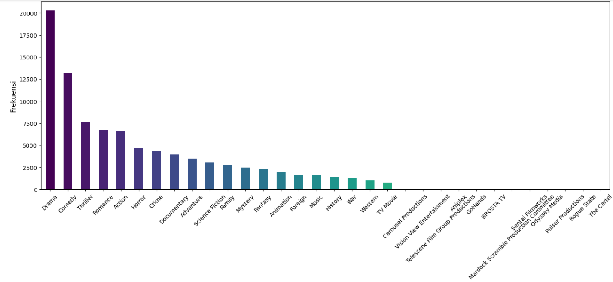
    Dari gambar grafik diatas, dapat dilihat bahwa genre Drama dan Comedy paling banyak tersebar pada setiap film dalam dataset dengan jumah sebesar 20265 dan 13182. Sedangkan genre yang lain berada dibawah 10000. Terlihat juga ada 12 genre dengan jumlah 1.

---

## Data Preparation

Langkah-langkah utama:

- Pilih kolom relevan (`id`, `genres`, `title`, `vote_average`, `vote_count`) dan rename `id` jadi `movieId`.
- Hapus missing values dan data duplikat pada metadata film.
- Ubah kolom `genres` dari JSON string ke list nama genre.
- Gabungkan data rating dengan metadata film berdasarkan `movieId`.
- Hapus kolom tidak diperlukan (`timestamp`, `vote_average`, `vote_count`).
- Sampling 20.000 data untuk pemodelan.
- Encode `userId` dan `movieId` menjadi integer berurutan.
- Normalisasi rating ke rentang [0,1].
- Bagi data jadi training (80%) dan validasi (20%).

**Penjelasan singkat:**
Tahapan data preparation tersebut penting dilakukan untuk memastikan data yang digunakan bersih, konsisten, dan dalam format yang sesuai agar model dapat belajar dengan baik. Menghapus data yang hilang dan duplikat mencegah bias dan kesalahan, sedangkan pengkodean dan normalisasi data memudahkan model dalam proses training. Sampling dan pembagian data ke set training dan validasi juga diperlukan untuk evaluasi performa model secara objektif. Dengan langkah ini, kualitas data terjaga sehingga hasil prediksi lebih akurat dan dapat diandalkan.

---

## Modeling & Results

### 1. Content-Based Filtering (CBF)

- Ubah `genres` ke string genre terpisah koma.
- Gunakan `TfidfVectorizer` untuk membuat matriks TF-IDF genre.
- Hitung cosine similarity antar film.
- Fungsi rekomendasi mencari film mirip berdasarkan genre, hasil Top-N.

**Kelebihan:**

- Tidak perlu data rating pengguna lain.
- Rekomendasi transparan dan spesifik.

**Kekurangan:**

- Terbatas pada fitur genre.
- Bisa overspecialize, kurang eksplorasi.
- Sulit untuk item baru tanpa fitur.

#### Result (CBF)

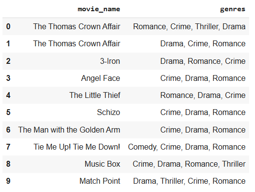
Hasil yang diperoleh berupa daftar judul film yang memiliki kesamaan genre dengan film yang dipilih yaitu ("Made in Hong Kong")

### 2. Collaborative Filtering (CF) dengan Deep Learning

- Model `RecommenderNet` dengan embedding layer untuk user dan movie.
- Output prediksi rating memakai dot product embedding + bias dan sigmoid.
- Kompilasi dengan Adam optimizer, loss MSE, metrik MAE dan RMSE.
- Latih dengan early stopping.
- Fungsi rekomendasi prediksi rating film yang belum ditonton, ambil Top-N tertinggi.

**Kelebihan:**

- Tangkap pola non-linear kompleks.
- Dapat temukan kesamaan laten.
- Performa meningkat dengan data besar.

**Kekurangan:**

- Butuh data interaksi banyak.
- Model kurang transparan (black box).
- Pelatihan mahal secara komputasi.

#### Result (CF)

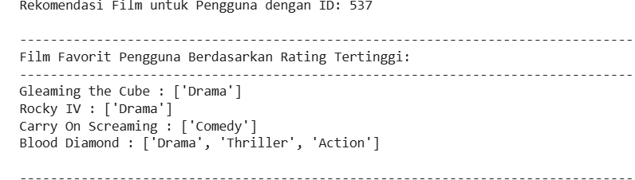
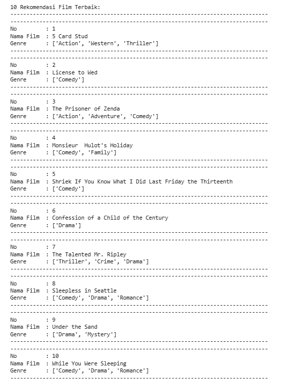
Hasil yang diperoleh berupa daftar judul film berdasarkan film dengan rating tertinggi dari user dengan id 537

---

## Evaluation

### Content-Based Filtering

- Metrik: **Precision**
- Definisi: Rasio rekomendasi yang relevan (genre sama persis).
- Hasil: Precision 100% untuk film _Made in Hong Kong_ (10/10 rekomendasi relevan).

### Collaborative Filtering (Deep Learning)

- Metrik: **MAE** dan **RMSE**
- Hasil setelah 10 epoch (early stopping):

| Data       | Loss (MSE) | MAE    | RMSE   |
| ---------- | ---------- | ------ | ------ |
| Training   | 0.0293     | 0.1300 | 0.1679 |
| Validation | 0.0471     | 0.1669 | 0.2132 |

- Visualisasi metrik menunjukkan penurunan MAE dan RMSE pada training, stabil di validasi, menandakan model belajar dengan baik namun perlu awasi overfitting.

---

## Referensi

- Sarwar, B., Karypis, G., Konstan, J., & Riedl, J. (2001). _Item-based collaborative filtering recommendation algorithms_. Proceedings of the 10th international conference on World Wide Web, 285-295.
- Pazzani, M. J., & Billsus, D. (2007). _Content-based recommendation systems_. The adaptive web, 325-341.

---

## Catatan

Laporan ini adalah ringkasan lengkap proses mulai dari business understanding, data understanding, data preparation, pemodelan, hingga evaluasi performa sistem rekomendasi film yang dibangun.
